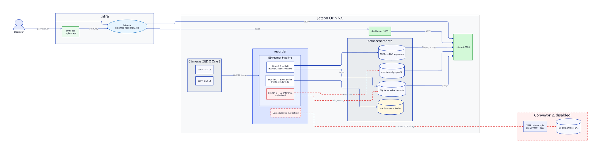

# Orwell

**Edge DVR with AI** for NVIDIA Jetson Orin NX + Stereolabs ZED X One S cameras.

Orwell records cameras continuously into a **circular buffer**, lets you **clip and download intervals** remotely over **Tailscale**, and (Phase 2) runs **local AI** that triggers **~10 s clip uploads** per detected event to the cloud.

## Architecture

## Stack

| Layer | Technology |
|---|---|
| Capture & encode | DeepStream (`pyds`), Argus (`nvarguscamerasrc`), NVENC H.265 |
| Control plane | FastAPI |
| Storage | fMP4/CMAF ~4 s segments + HLS playlist + SQLite index on NVMe |
| Remote access | Tailscale |
| Deployment | docker-compose (POC) → K3s + Rancher Fleet (fleet) |

**Hardware:** Jetson Orin NX (NVENC → HW encode) — Orin Nano is a fallback (SW H.264). Cameras connect via GMSL2; the Stereolabs driver runs on the host (kernel-level, not containerizable).

## Services

| Service | Role |
|---|---|
| `recorder` | Continuous capture, HW encode, circular write |
| `clip-api` | `GET /clips?camera&start&end` → MP4 (stream copy) |
| `gateway` | Single HTTP edge: `/`, `/api`, `/preview` |
| `preview` | Live RTSP/HLS/WebRTC via MediaMTX |

## Roadmap

- [ ] **Phase 1 (POC):** continuous 2-camera recording, rotation, SQLite index, Clip API over Tailscale
- [ ] **Phase 2:** TensorRT model → events → clip upload (transport TBD)
- [ ] **Phase 3:** K3s + Rancher Fleet, private registry, production WebRTC

## Docs

[Architecture](docs/architecture.md) · [Hardware](docs/hardware.md) · [Glossary](docs/glossary.md) · [Operations](docs/operations.md) · [ADRs](docs/decisions/) · [Deploy guide](DEPLOY.md)
